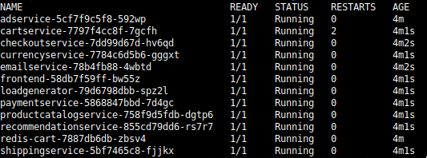
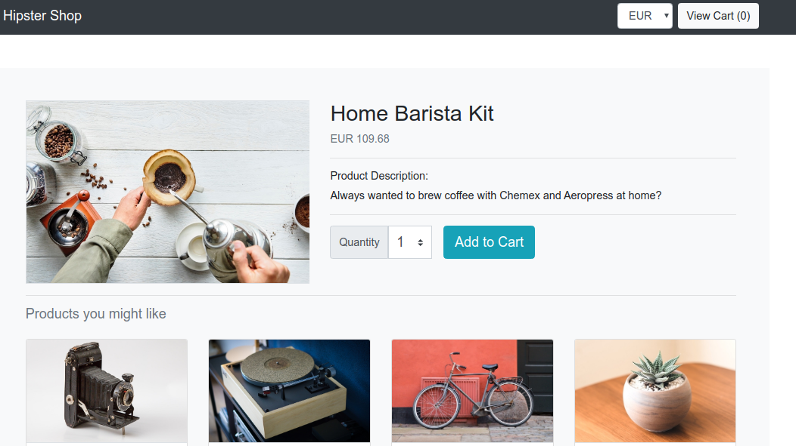
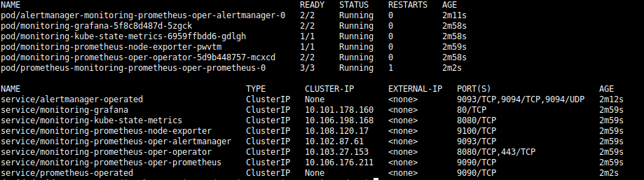
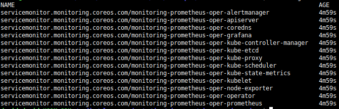
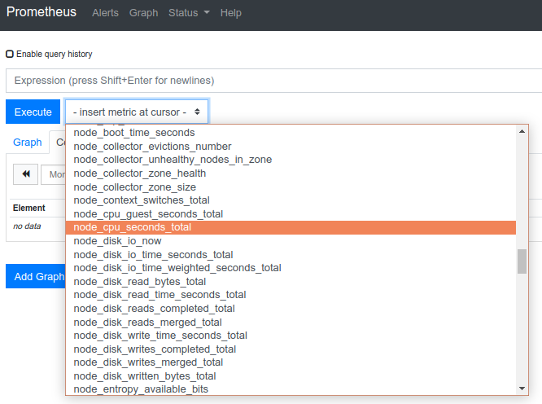
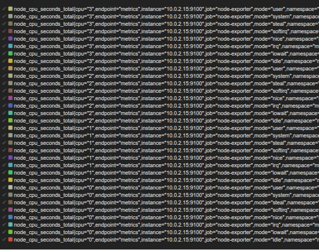
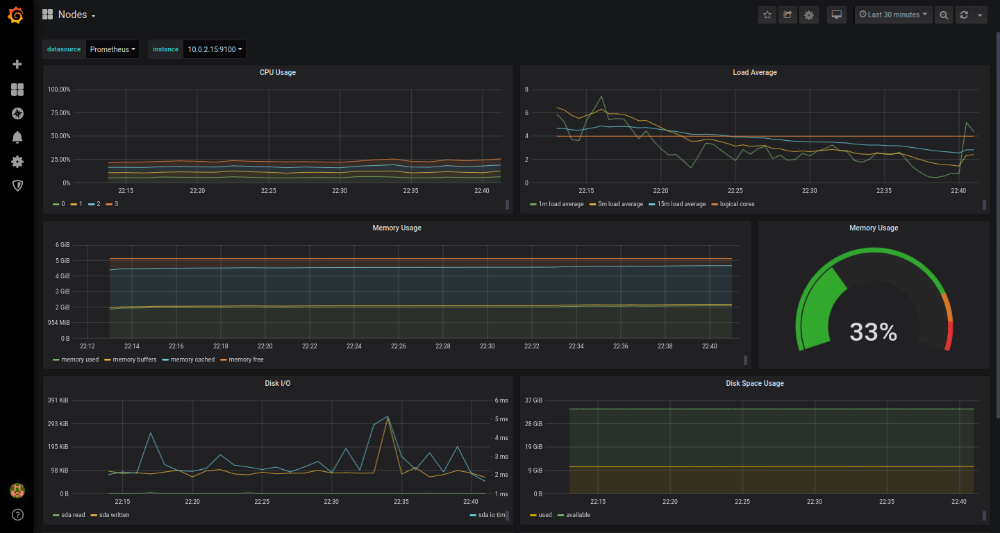
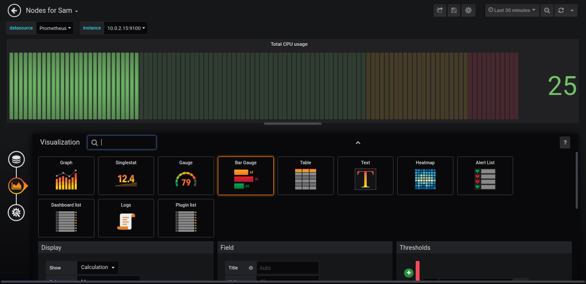
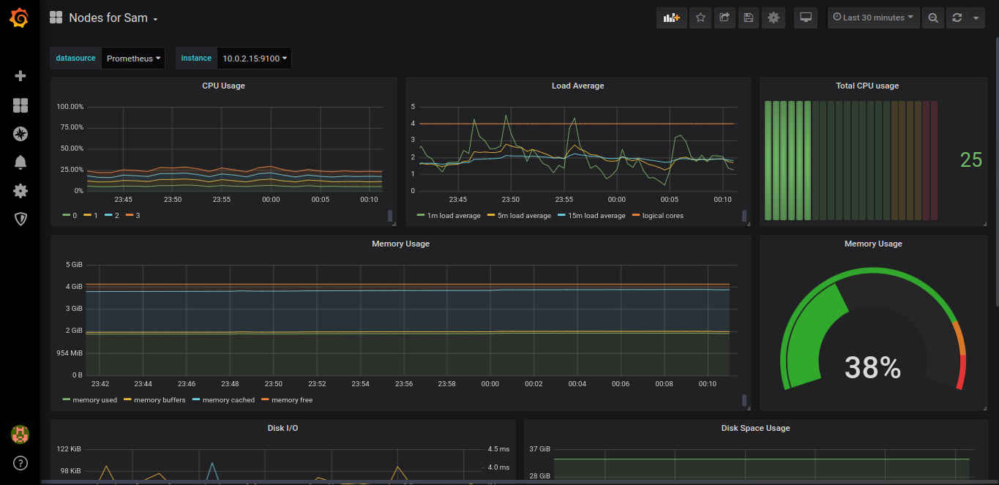
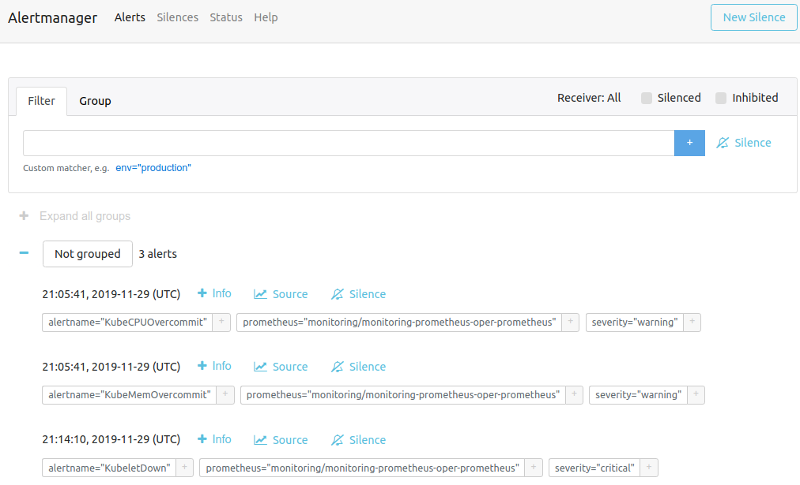

# How to monitor Hipster Shop app

In this article we will introduce the basics of [Prometheus](https://prometheus.io/ "Prometheus") metrics and how to extract, visualize and use the data monitored through a practical example. We will use the [Hipster Shop demonstration of microservices](https://github.com/GoogleCloudPlatform/microservices-demo "Hipster shop") as a case of use, and for the infrastructure we will deploy our cluster on [minikube](https://kubernetes.io/es/docs/tasks/tools/install-minikube/ "Minikube"), the all-known training kubernetes tool.

To create the cluster in minikube we will need to create the cluster with at least 3 CPUs and 4GB of RAM. Also, we will add the ingress-addon.
```
minikube start --cpus=3 --memory='4000mb'
minikube addons enable ingress 
```
To deploy our online shop the following line can be used: 

```
git clone https://github.com/GoogleCloudPlatform/microservices-demo
kubectl apply -f ./microservices-demo/release/kubernetes-manifests.yaml
```

After the installation, the following pods will appear in the cluster.



# Why monitoring? 
Let’s put ourselves for a moment in the shoes of Sam, a devops engineer working in The Hipster Shop, an online ecommerce company that has grown increasingly in the last years selling amazing and expensive, products for men’s facial-hair care and other vintage gadgets. 



It is Black Friday’s eve and the CEO is getting ready to go home with a huge smile in his face, a frapuccino in his hand and just before he cross the door turns and congratulates everyone for the new campaigns that the marketing team uploaded to the web page, just in time for tomorrow. He also thanks the dev-team to deploy some hours ago a patch to be able to implement the idea that he had yesterday for the Black Friday (free tickets for the next KubeCon for the largest order in the first hour of friday's night). Just befor going he turnd and says something like “This will be a great Weekend! We have an online shop and It’s Black Friday! What can go wrong?”.

Just after he closes the door after him, that rhetorical question triggers a chain of terrible other questions in your senior-devops head. Will the cluster be enough for the pods when they all scale up in peak moments? Did any of the developers mess up the quotas of the containers? Did the just-deployed patch affected something, somewhere else in the cluster, that is still to be discovered? Will our shop be hipster enough if the lag is too high or will our long-beard customers run away to our competence? And the most important one… When will we discover that something goes wrong?

Monitoring tries to answer all these questions.

# Prometheus in a nutshell 
Prometheus is an open source project that has the honor to be one of the graduated projects of the Cloud Native Computing Foundation (just like Kubernetes!). It is usually used for monitoring could applications and usually comes paired with [Grafana](https://grafana.com/grafana/ "Grafana"), a visualization platform that allows to analyze and study the data in user-friendly dashboards. 


But its real success comes not only for its data analytics capabilities, but also for the great amount of services and applications that come with ready-to-use metrics for Prometheus, the availability of exporters for the cases that they don't come natively and the capacity to implement your own metrics in your application through clients in the main programming languages. All these makes Prometheus the de-facto standard tool for monitoring metrics of cloud applications.

Also, living in could native environments makes it important (some would say compulsory) the capacity to be able to use auto-discovery in order to automatically scrap metrics from services in the server. This is another feature that makes Prometheus useful in auto-scaling environments, with volatile pods and nodes that are created by automated tools in moments of high demand. 

Finally, Prometheus not only has the capacity to register the metrics that it gathers through the cluster, but also can trigger actions based on rules configured. Imagine an email or an slack message when a node memory reach a certain limit. 


# That sounds good, but how do I integrate it in my cluster?
Prometheus can be deployed directly in a cluster. All that is needed is to set a deployment with the Prometheus image and a ConfigMap that will be used to pass the configuration file with the definition of the metrics and where to get them. 

This would be the usual way to deploy Prometheus, but in this case we will introduce Prometheus Operator. But, what is Prometheus Operator and why is it better for Sam? 

First of all, after its installation with helm it automatically comes with a set of basic out-of-the-box metrics that we all need in our clusters, like information about the node, the pods or the Kubernetes services. Also automatizes the creation of rbac and comes with an alert manager and a Grafana just ready to use with useful dashboards available in one click. 

This all is enough to make Sam happy for not having to prepare and configure standard setups for her cluster, so let's get a Prometheus operator in our Hipster Shop cluster:

```
kubectl create serviceaccount tiller --namespace kube-system
kubectl create clusterrolebinding tiller-role-binding --clusterrole cluster-admin --serviceaccount=kube-system:tiller
helm init --service-account tiller 
helm install stable/prometheus-operator --version=8.2.4 --name=monitoring --namespace=monitoring
```

For further details on this installation, you can have a look at [this tutorial](https://medium.com/faun/trying-prometheus-operator-with-helm-minikube-b617a2dccfa3 "Installing Prometheus Operator in minikube") that Sam found. Let's have a look at the pods and services that are created in the cluster:



As we can see, a new namespace has been created, along with the services needed for the pods. Along with the Prometheus, alert manager and Grafana pods, we see other pods. We will get to them later. Before, there is something else that makes Sam even happier. 

Prometheus operator defines some new CRDs (custom resource definitions), among them: ServiceMonitor and PodMonitor. While in the usual configuration of Prometheus the configuration of the metric scrappers is passed through a ConfigMap, these two resources allows to create independent configurations for the different services or pods to be monitored. 

This is a good way to maintain the configuration of the cluster, while updating or adding a new set of metric does not imply modifying the whole unique configuration file passed through a ConfigMap (with the risks of accidentally change something that is already working). Also, being defined as a resource, all the needed syntax checks are passed, contrary to what happens if the configuration data is passed in the traditional way.  Sam just have to add a new ServiceMonitor with the labels of the service to be scrapped for new metrics and the Prometheus server will automatically get the configuration and start to monitor it.

The ServiceMonitor and PodMonitor created in the installation can be seen like this: 

```
kubectl get servicemonitors,podmonitors -n monitoring
```


Here is a simple example of a ServiceMonitor extracted from one of the installed: 
```
apiVersion: monitoring.coreos.com/v1
kind: ServiceMonitor
metadata:
  creationTimestamp: "2019-11-28T21:47:44Z"
  generation: 1
  labels:
    app: prometheus-operator-node-exporter
    chart: prometheus-operator-8.2.4
    heritage: Tiller
    release: monitoring
  name: monitoring-prometheus-oper-node-exporter
  namespace: monitoring
  resourceVersion: "4352"
  selfLink: /apis/monitoring.coreos.com/v1/namespaces/monitoring/servicemonitors/monitoring-prometheus-oper-node-exporter
  uid: 9b35da36-2382-4fbd-b4eb-51795d13da23
spec:
  endpoints:
  - port: metrics
  jobLabel: jobLabel
  selector:
    matchLabels:
      app: prometheus-node-exporter
      release: monitoring
```

# Let’s start monitoring our Hipster Shop
Now we have a Prometheus operator in our Hipster Shop. Along with the pods for Prometheus and Grafana we saw before other resources (pods, services, ServiceMonitors...) that have the 'exporter' word in their names. These are the services that comes in the installation of the Prometheus Operator and that they will help to start monitoring the vitals of our cluster. 

Before starting to monitor the cluster, it is a good practice to define first what do we want to know. A big amount of metrics can produce noise and hide important ones. In the other side, if we do not define correctly the monitoring needs, we can believe that there is no problems just because we do not see it in the incomplete graphics.

While the rest of the world see a web populated with fancy looking products and amazing offers for Black Friday, Sam sees this:


There are some special situations that worries her: 

* The cluster is dimensioned to behave correctly even in high demanding situations, like Christmas, but today the boss had an idea that can make that all the traffic to concentrate in just one hour (if you already planned to buy something, better to do it from 00:00 to 00:59 and have the chance to win a free travel to the next KubeCon). Will the nodes of the cluster be enough?
* Also, to be able to get it ready, the development team had to work all the day and the deployment was made in the last hours, with no time for canary releases. Can it affect the pods? Or other pods?
* And last, but not least, the marketing team also worked hard to be able to upload all the resources. Will there can be not working links, images...? Will the new offers trigger a yet-to-know bug that makes the paying service unavailable?

To be able to address this monitoring needs, we will approach a bottom-up strategy. First we will see How Prometheus can give information about the node itself. To explore the metrics that are being gathered, we can access the front-end of Prometheus. 

```
kubectl port-forward -n monitoring prometheus-monitoring-prometheus-oper-prometheus-0 9090
```

Accessing http://localhost:9090/graph we can find the front-end of Prometheus with a list of all the metrics available.

First of all, Sam is interested in the general health of the node. There are some parameters that are important in every system, such as CPU usage, free memory, disk space, network activity... To be able to get these metrics from our nodes there is one of the exporters installed by the Prometheus Operator that can help us: the Node Exporter. This exporter gathers general system information and makes it available for Prometheus. Getting to the Prometheus front-end, we will find in the drop down menu these metrics starting by 'node_':



Some of the metrics that we will use for monitoring the node will be: 
* node_cpu_seconds_total: For CPU usage
* node_memory_MemAvailable_bytes: For memory usage
* node_filesystem_avail_bytes: For disk space usage
* node_network_receive_bytes_total and node_network_transmit_bytes_total: For network activity


Let's explore in the 'Graph' panel one of the selected metrics. For example, let's try to visualize the CPU utilization. In the drop down menu we will find the 'node_cpu_seconds_total' metric, select it and click 'Execute'. A graphic with many lines will appear and a text box with lots of data under it. 

We can see that in the graph, none of the lines goes ever down. This is because this kind of data is called a 'counter' in Prometheus, and they are always increasing their value. Other kind of data, like 'gauge', can go up and down. 

In the text just below the graphs we can find some interesting information about this metric: 



As we can see, a metric can be defined by different values tagged as labels. In this case, we can see that the instance can give information about the seconds of each of the CPUs of the node (with the 'cpu' label) spent in different 'modes' ('idle', 'system', 'nice', 'iowait'..). 

Let's first try to see the time used by each CPU. But to do this, we would have to subtract one value from the next one and divide it for the integration time in order to calculate the seconds per seconds used... But don't worry, because Sam just found out that the Prometheus query language (promQL) makes it all by himself. WE just have to write in the text box the following query to have the same graph, but with an integration interval of 5 minutes: 

```
rate(node_cpu_seconds_total[5m])
```

But we can go further and sum all the lines with the same CPU and have the time spent for each CPU:

```
sum by (cpu) (rate(node_cpu_seconds_total[5m]))
```

But Sam knows that the CPUs are always up, so, the values will be always 1... unless we filter all the labels different from 'idle':

```
sum by (cpu) (rate(node_cpu_seconds_total{mode != 'idle'}[5m]))
```

That is almost perfect... but we can make it a percentage of the CPU utilization just subtracting the idle time of the CPU to the total time with these queries: 

```
# CPU usage per CPU
100 * (1 - rate(node_cpu_seconds_total{mode = 'idle'}[5m]))

# CPU average usage
avg (100 * (1 - rate(node_cpu_seconds_total{mode = 'idle'}[5m])))
```

As we can see in these examples, promQL is a powerful way to explore the data and look wor information filtering by labels, combining the metrics values and introducing formulas and making statistical operations. 

There are other metrics that can give us information about the performance of the node: 
* node_network_receive_bytes_total and node_network_transmit_bytes_total: For the throughput of the connection
* node_network_receive_errs_total and node_network_transmit_errs_total: For networking errors

But also, there are other exporters that can help to detect and identify problems not only in the host machine, but in the cluster. We can find some interesting metrics, like 'kube_pod_container_status_restarts_total'. This metric gives information of the number of restarts that has suffered a pod, that can be caused by internal malfunction of the container, making it unhealthy or problems in the quotas that makes Kubernetes to kill pods.

# Visualizing the data
It seems that with these metrics being gathered we have an amazing way to select a specific metric, visualize what is happening, and make the forensics if something bad happens. But Sam is still not calmed. She knows that at 00:01 she will not be able to sleep and she will be in the screen selecting one metric after another just to check that everything goes as expected. Still not so useful when you want to know just with a quick look if something is wrong. 

Here is when Grafana comes in the rescue. This close friend of Prometheus provide us with ready-to-use dashboards that Sam can check from the tablet or even by her phone. Also, creating new panels with our own custom metrics graphs and gauges is as easy as creating a promQL sentence and add it to the panel. 

To access Grafana, we just have to redirect the port of the service (user: admin / pass: prom-operator): 

```
kubectl port-forward $(kubectl get pods --selector=app=grafana -n monitoring --output=jsonpath="{.items..metadata.name}") -n monitoring 3000
```

Prometheus Operator has some configuration for Grafana that make available a set of ready-to-use dachboards with the most important cases of use. In this case, Sam is lucky to find a dashboard with almost all the information that she was wanting to see from the node: 



Just adding a new panel to see the total usage of the CPU would be great. All Sam has to do is to create a new dashboard copying the node one and add new panel. To correctly configure the visualization she has to choose a correct kind of panel (there are many options depending on the kind of data and usage that we need), and the promQL sentence that we used before in the Prometheus front-end interface.



After adding the new panel, the panels can be moved and arrange visually until getting the layout that she likes most.



Finally, Sam also creates another dashboard with panels showing the state (1 for up, 0 for down) of the diferent services of the kubernetes cluster: the Api Server, Scheduler, Admission Controller and the Etcd database. This makes her easier to see the general state of the cluster and check that they are all up and running.   

# Alerting when something goes wrong
At this point, Sam is quite better that in the beginning of the story, but now she is checking her phone every 5 minutes to see the Grafana dashboards that she just configured in the cluster, not only because she likes the well-defined fancy-colored widgets over dark background, but just to get sure that everything goes on working as it should. 

Fortunately for her (and for everyone in a similar position), Prometheus itself cannot send notifications when something happens, but comes with an integrated way to alert another service that comes with the helm Prometheus Operator installation, the Alert Manager. 

Sam, in order to notify someone when the node of the cluster is about to get stalled for reaching the limit of memory, CPU, disk available, etc. there are two things that need to be configured. The first one is a rule in Prometheus that will push the alert to the Alert Manager. 

In a standard configuration of Prometheus, these rules are integrated either in the configuration file of Prometheus or in other specific files of rules. But, as happened in the case of the scraping endpoint, Prometheus Operator also defines CRDs for the rules, making them easier to write, maintain and deploy. We can list the Prometheus Rules that we have in our cluster like this: 

```
kubectl get prometheusrules -n monitoring
```

In the list we can see that there is already a set of rules that creates recorded metrics and even alerts. But in this case, Sam wants to cerate a new alert to notify herself when the average CPU of the node is over 50% for more than 10 minutes. To do this, we create a yaml file called 'monitoring-custom-rules.yaml' with the following content:

```
apiVersion: monitoring.coreos.com/v1
kind: PrometheusRule
metadata:
  labels:
    app: prometheus-operator
  name: monitoring-custom-alerts-node.rules
  namespace: monitoring
  resourceVersion: "4283"
spec:
  groups:
  - name: monitoring-custom-alerts-node.rules
    rules:
    - alert: CPUOver50pctFor10m
      annotations:
        message: The CPU has been over 50pct for more than 10 minutes
      expr: avg (100 * (1 - rate(node_cpu_seconds_total{mode = 'idle'}[5m]))) > 50
      for: 10m
      labels:
        severity: critical
```

And apply the file to create a new Prometheus Rule: 
```
kubectl apply -f monitoring-custom-rules.yaml
```

We have done half of the configuration. Now we have to configure the Alert Manager to make it send an email when receiving critical alerts. 

The Alert Manager uses a configuration based in filtering alerts and group them by labels, defining this way receivers for this groups. To explore the configuration, the alert Manager comes with an integrated front-end interface. To access it the port 9093 of the pod has to be exposed:

```
kubectl port-forward $(kubectl get pods --selector=app=alertmanager -n monitoring --output=jsonpath="{.items..metadata.name}") -n monitoring 9093
```


The configuration of the Alert Manager is done through a secret in the namespace for monitoring, where the configuration data is passed in a base64 encoded string. To recover the configuration we can do it this way: 

```
echo $(kubectl get secrets --selector=app=prometheus-operator-alertmanager -n monitoring --output=jsonpath="{.items..data.alertmanager\.yaml}") | base64 -d
```

The result is the following: 

```
global:
  resolve_timeout: 5m
receivers:
- name: "null"
route:
  group_by:
  - job
  group_interval: 5m
  group_wait: 30s
  receiver: "null"
  repeat_interval: 12h
  routes:
  - match:
      alertname: Watchdog
    receiver: "null"
```

Now, all Sam has to do is modify the configuration file to define a receiver with her email and a route for the Alert Manager to send her the emails. In this case, she decided to get notified by all the critical alerts that happen in the node. 

```
global:
  resolve_timeout: 5m
  smtp_smarthost: 'localhost:25'
  smtp_from: 'alertmanager@thehipstershop.cloud'
receivers:
- name: "null"
- name: "devopsteam.alerts"
  email_configs:
  - to: "devopsteam.alerts@thehipstershop.cloud"
route:
  group_by:
  - job
  group_interval: 5m
  group_wait: 30s
  receiver: "null"
  repeat_interval: 12h
  routes:
  - match:
      alertname: Watchdog
    receiver: "null"
  - match:
      severity: critical
    receiver: "devopsteam.alerts"
```

After getting ready the new configuration file, make the base64 string and apply again the modified secret to make the Alert Manager to update its configuration. 

# That's a great start, what's next? 
That night Prometheus fulfilled the mission for which it was created for (let the devops engineers sleep peacefully) and Sam wakes up in the morning with no notifications from the alerts that she configured. 

The next days she will study how was the traffic evolution during that moments and the following days in order to dimension better the cluster and the scaling of the services for future high demand situations and prepare plan for optimize the costs of the cluster resources for the CTO. As she was suspecting after reading the [Sysdig container usage report for 2019](https://sysdig.com/blog/sysdig-2019-container-usage-report/ "Sysdig container usage report for 2019") that says that more than 50% of the containers live less than 5 minutes, she will discover that most of the time the cluster resources are under 60% of utilization and that they can save money contracting smaller virtual machines that can be scaled up by demand, in stead of the over dimensioned ones that they are using regulary.

But there are some parameters that are missing in the metrics that she is gathering right now. She would like to know the latency of the front-end, but with the current exporters that she has there is not an easy way to do it. Also, now she is getting the network connetion errors, but not the amount of pages not being served by HTTP errors. That is why Sam implements a new service to be able to reach the por for the [built-in metrics that the Nginx ingress controller](https://docs.gitlab.com/ee/user/project/integrations/prometheus_library/nginx_ingress.html "Metrics of Nginx ingress controller for Prometheus") that she has in the cluster has already activated. Then, all she will have to do is to create a new Service Monitor resource and Prometheus will automatically start to scrap these new exporter. 

The aim to scrap the metrics of the ingress controller is that it can give Sam some valuable new information. The first one is the latency, as it has metrics for the HTTP connections and the networking time serving them. Making a division of these will give her the latency, one of the [golden signals](https://sysdig.com/blog/golden-signals-kubernetes/ "Monitoring golden signals in Kubernetes"). The second important metric that will give the ingress controller will be the number of web requests labelled by response status code. This will give Sam the chance to filter the number of error caused by the server (starting by 5XX) and the total, creating a new metric for the error rate (again another important golden signals)

Eventually, the Nginx ingress controller metrics also let her gather a third golden signal: the throughput (requests per second). Of course these new metrics will have their corresponding Prometheus Rules to be able to record them, a new pannel in Grafana with the network throughput, error rate and latency, and of course new alerting configuration both in the Prometheus Rule and in the Alert Manager. Following are the sentence that can be used as rules to create these new recorded metrics and use them in Grafana panels.

```
# promQL sentence for throughput
sum(label_replace(rate(nginx_ingress_controller_requests{ingress=~".*%{ci_environment_slug}.*"}[5m]), "status_code", "${1}xx", "status", "(.)..")) by (status_code)

# promQL sentence for latency
sum(rate(nginx_ingress_controller_ingress_upstream_latency_seconds_sum{ingress=~".*%{ci_environment_slug}.*"}[5m])) / sum(rate(nginx_ingress_controller_ingress_upstream_latency_seconds_count{ingress=~".*%{ci_environment_slug}.*"}[5m])) * 1000

# promQL sentence for error rate
sum(rate(nginx_ingress_controller_requests{status=~"5.*",ingress=~".*%{ci_environment_slug}.*"}[5m])) / sum(rate(nginx_ingress_controller_requests{ingress=~".*%{ci_environment_slug}.*"}[5m])) * 100
```

Also, Sam wants to get ready for the Christmas campaign and whe will talk to the development team in order to instrument the application and get metrics from the different services. The first one that she is willing to monitor is the redis database. After finding an [exporter for Redis](https://github.com/oliver006/redis_exporter "Redis metrics exporter for Prometheus"), they decide to change the yaml deployment file of the database to [include in the pod the container of the exporter as a sidecar](https://github.com/oliver006/redis_exporter/blob/master/contrib/k8s-redis-and-exporter-deployment.yaml "Example to include the Redis exporter as sidecar in a pod") and start to register data with a new Service Monitor.

In this server she would also want to measure golden metrics (throughput, latency and error rate) as well as other metrics such as clients connected, memory usage, the total items of each database and the up time of the service. 

Another service that will get some metrics soon is the email server. In this case, more than focuse in performance, Sam's team wants to monitor the activity of this service in order to be able to detect possible missuses of it, for example, to send massive spam. To do this they'll use the [Prometheus Python client](https://github.com/prometheus/client_python "Prometheus Python client to instrument the email microservice") and gather information about the number of emails sent, the number of receivers, the number of diferent domains, the bytes sent in total and the bytes sent in attached files.

The development team soon starts to use in an regular way Prometheus in the namespaces of the cluster dedicated for development and testing in order to improve response times of some services and discover some situations that were causing the sudden failure of the recommendation service as they saw that the number of created pods was increasing with no reason for scaling, along with some memory leaks in other services.

Unexpectedly, the marketing team happen to see one of the dashboards in her screen and they are interested in talking to the development team in order to see if it is possible to create metrics of the orders and sales generated by the different campaigns that they publish, in order to study how different campaigns succeed in different hours or profiles (also, they want a fancy dashboard with graphs and gauges ready to copy-paste in their presentations and show to their friends in the phone). For this, the [Prometheus clients in different languages](https://prometheus.io/docs/instrumenting/clientlibs/ "Catalog of Prometheus client libraries") will be used to create end points with metrics that can be directly scrapped like any other service. 

This is Sam. Sam monitors with Prometheus. Sam sleep peacefully at night. Sam optimize her cloud resources using metrics. Sam is smart. Be like Sam.
